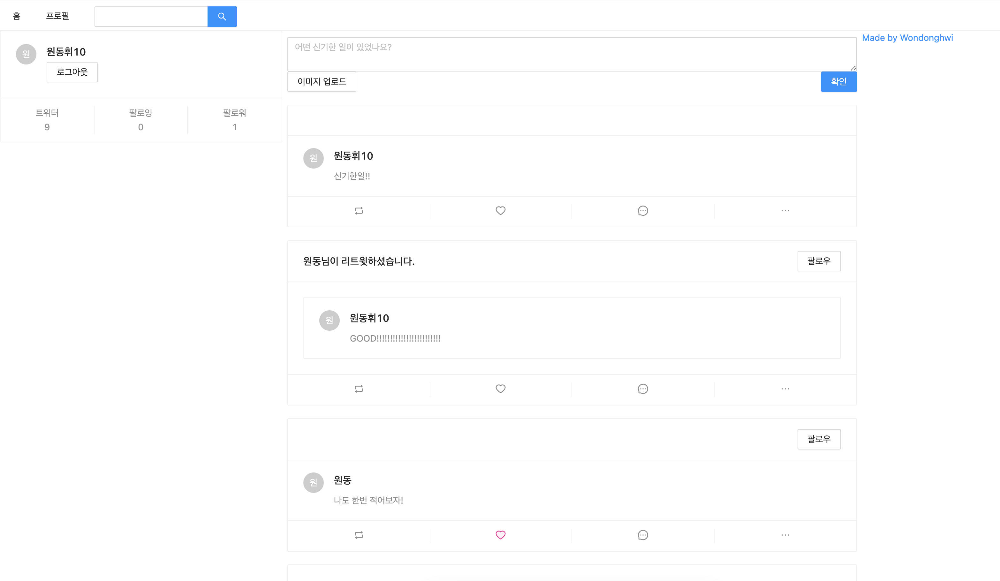

## Next.js + Node.js를 이용해 Twitter 만들기 Project

donghwi-reactbird.shop 도메인으로 이용 (현재 도메인 이용기간 종료이유로 AWS EC2 종료로 접속 불가)
~~http://donghwi-reactbird.shop~~

<b>아래를 클릭하면 프로젝트 동영상이 나옵니다.!</b>

> Front-End
- ant-design
- next.js
- styledComponents
- Redux - Saga

> Back-End
- node.js
- express

> Aws EC2 배포 진행
- front Ec2 서버 사용 (현재 종료)
- back Ec2 서버 사용 (현재 종료)
- S3 사용 (이미지 올리기용도로 사용)
- lambda 사용

> nginx를 이용해 https 주소를 사용할 수 있도록 서버쪽 작업 진행
